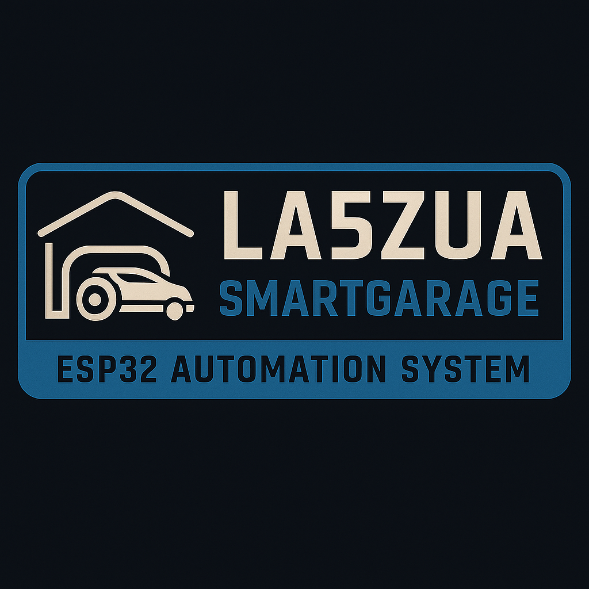

# 🚗 LA5ZUA-SmartGarage
Prosjekt 2 av **LA5ZUA Tech DIY Series**



[](LICENSE)


Et komplett, ESP32-basert automasjonsprosjekt for **Gardena robotklipper-garasje**.  
Systemet åpner og lukker porten automatisk, styrer utelys etter lysnivå og klokke,  
viser sensordata på webgrensesnitt, og kan oppdatere seg selv via GitHub (OTA).


## 📦 Prosjektstruktur
LA5ZUA-SmartGarage/
├── src/ → ESP32-koden (esp32_kode.ino)
├── firmware/ → OTA-filer (latest.bin, version.txt, changelog, README)
├── docs/ → Skjemaer, pin-oversikt og tekniske notater
├── assets/ → Logoer, banner og PCB-layout
└── README.md → Denne filen

## ⚙️ Funksjoner
- 🧠 ESP32-styrt garasjeport for robotklipper  
- 🔁 Aktiv LOW rele-styring (trygg for ESP32)  
- 💡 Automatisk utelys (LM393 lyssensor + tidsstyring 16:00–08:00)  
- 🌡️ DHT22 temperatur/fukt-måling  
- 🔘 Manuell bryter (clipper) for å starte porten  
- 🌱 Analog soil-sensor for fuktindikasjon  
- 🌐 Innebygd webgrensesnitt for status og styring  
- 🔄 OTA-oppdatering via GitHub  

## 🧩 Pin-konfigurasjon
| Komponent | GPIO | Kommentar |
|------------|------|-----------|
| Rele ÅPNE | 26 | Aktiv LOW |
| Rele LUKKE | 27 | Aktiv LOW |
| Rele LYS | 33 | Aktiv LOW |
| LM393 Lyssensor | 19 | LOW = mørkt |
| DHT22 Sensor | 21 | Data (10 kΩ pull-up til 3.3 V) |
| Clipper bryter | 17 | Til GND, aktiv LOW |
| Soil sensor | 32 | Analog inngang |

Se flere detaljer i [`docs/pinout.txt`](docs/pinout.txt).

## 🌐 OTA-oppdatering (Over-The-Air)
ESP-en sjekker automatisk GitHub-filene ved oppstart:

```cpp
const char* versionURL = "https://raw.githubusercontent.com/Mrmoen/LA5ZUA-SmartGarage/main/firmware/version.txt";
const char* binURL     = "https://raw.githubusercontent.com/Mrmoen/LA5ZUA-SmartGarage/main/firmware/latest.bin";
Når versjonen på GitHub er nyere enn den som kjører på enheten,
laster ESP-en ned latest.bin og installerer oppdateringen automatisk.

Detaljerte instruksjoner finnes i firmware/README.md.

🔌 Koblingsskjema

Se også full tekstlig forklaring i docs/wiring-diagram.txt

🧠 Om prosjektet
LA5ZUA-SmartGarage er Prosjekt 2 i LA5ZUA Tech DIY Series –
en samling åpne, ESP32-baserte prosjekter utviklet av Mrmoen (LA5ZUA)
for automatisering, sensormåling og smart-styring i hverdagen.

📅 Versjon og status
Gjeldende firmware: v1.1.9

Sist oppdatert: 29.11.2025

Se firmware/changelog.txt for detaljer.

🧰 Lisens
Distribuert under MIT-lisensen.
Se LICENSE for full tekst.

## 💖 Støtt prosjektet
Hvis du liker **LA5ZUA-SmartGarage** og bruker koden min i egne prosjekter,
setter jeg veldig stor pris på om du gir prosjektet en ⭐ på GitHub!  
Det hjelper meg å nå ut til flere og holde **LA5ZUA Tech DIY Series** i gang.

Dersom du er ekstra fornøyd og ønsker å bidra økonomisk til utvikling av
neste prosjekt i serien, setter jeg også stor pris på en liten støtte.

☕ **Støtt utviklingen:** (https://ko-fi.com/la5zua)

💡 *Hver krone går til komponenter, testing og utvikling av nye DIY-prosjekter.*

👾 **Join the community:** [Echo Base Discord](https://discord.gg/6UgDFC8PNm)


© 2025 LA5ZUA Tech DIY Series – SmartGarage
Utviklet av Mrmoen (LA5ZUA)

⚠️ Ansvarsfraskrivelse / Disclaimer

⚙️ Bruk på eget ansvar.
Dette prosjektet er utviklet som et hobbyprosjekt og deles for læring og inspirasjon.
Jeg er ikke elektriker eller fagperson innen elektronikk – all bruk, bygging og testing skjer på eget ansvar.
Sørg for å følge grunnleggende sikkerhet ved arbeid med strøm, og test alltid med lav spenning før permanent oppkobling.

Koden, koblingsskjema og dokumentasjon leveres «som den er», uten noen form for garanti for funksjon, sikkerhet eller kompatibilitet.

Bruk prosjektet trygt, lær noe nytt, og del gjerne forbedringer i fellesskapet!

⚙️ Use at your own risk.
This project is provided for educational and hobby purposes only.
I am not a certified electrician — all building, wiring and testing is done at your own risk.
Always ensure proper safety measures when working with electronics or mains power.

The code and documentation are provided “as is”, without warranty of any kind.

Stay safe, have fun, and share your ideas with the community!